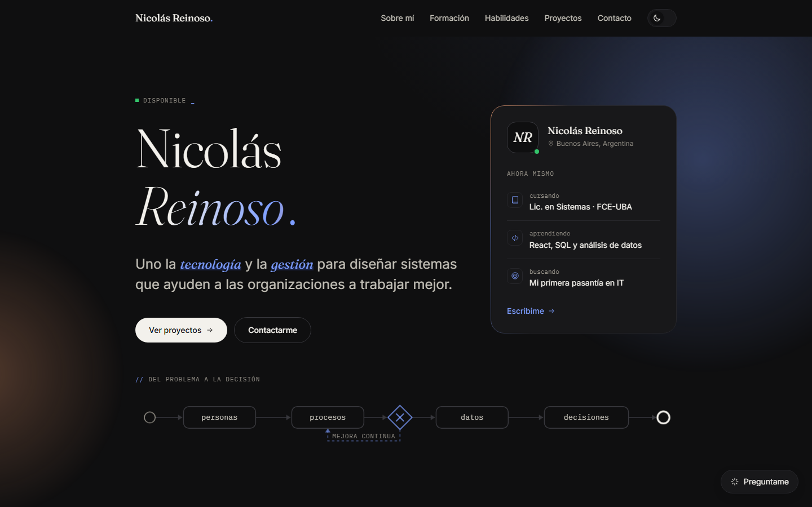
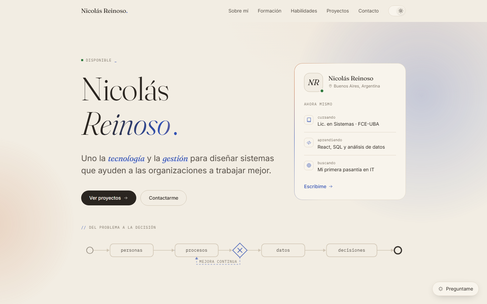

# Nicolás Reinoso — Portafolio

Portafolio personal con **panel de administración propio**: estadísticas de visitas, bandeja de mensajes, contenido editable y un asistente con **IA (Google Gemini)** que conoce mi perfil, mis repositorios y las métricas del sitio.

Estudio la **Licenciatura en Sistemas de Información de las Organizaciones** (FCE-UBA). Este proyecto junta las dos cosas que más me interesan de la carrera: entender qué necesita una organización (en este caso, yo mostrándome a reclutadores) y construir la herramienta que lo resuelve y lo mide.



<details>
<summary>Ver en modo claro</summary>



</details>

---

## Qué incluye

### Sitio público
- **Secciones:** Sobre mí (intereses y objetivos), Formación, Habilidades, Proyectos y Contacto.
- **Proyectos desde GitHub:** se traen automáticamente con la API de GitHub, con caché de una hora.
- **Chatbot "Preguntame":** responde preguntas de visitantes sobre mi perfil usando Gemini, limitado a la información real del portafolio.
- **Formulario de contacto** con protección anti-spam (campo trampa y límite de envíos por IP).
- **Modo oscuro (predeterminado) y claro**, con transición circular y sin parpadeo al cargar.
- **Animaciones con propósito:** un diagrama de proceso estilo BPMN que se dibuja solo, desplazamiento animado entre secciones, aparición escalonada del contenido y tarjetas que reaccionan al mouse.
- **Responsive** y accesible: HTML semántico, navegación por teclado y contraste cuidado en los dos temas.

### Panel de administración (`/admin`)
| Vista | Qué hace |
|---|---|
| **Resumen** | Visitas, visitantes únicos y recurrentes, tiempo en la página, tasa de contacto, gráfico diario, actividad reciente y checklist de mejoras. |
| **Tráfico** | Horarios y días con más visitas, links con seguimiento (`?ref=`), referencias, dispositivos, navegadores, idiomas, países y conversaciones del chatbot. |
| **GitHub** | Repos, lenguajes y "salud" de cada repositorio (descripción, topics, demo). |
| **Mensajes** | Bandeja con búsqueda, filtros, destacados, exportación a CSV y borradores de respuesta con IA. |
| **Asistente IA** | Auditoría del portafolio, reporte semanal, análisis del chatbot, posts y bio para LinkedIn, README, ideas de proyectos y preparación de entrevistas. |
| **Configuración** | Contenido del inicio editable sin tocar código, chatbot on/off, generador de links con seguimiento, backup y borrado de datos. |

Las estadísticas son **propias y anónimas**: no hay cookies de terceros, los bots se ignoran y las visitas del administrador no se cuentan.

---

## Stack

| | |
|---|---|
| **Framework** | [Next.js 16](https://nextjs.org) (App Router, Server Components, Route Handlers) |
| **UI** | React 19 · TypeScript · [Tailwind CSS 4](https://tailwindcss.com) |
| **Tipografía** | Fraunces (títulos) · Inter (texto) · IBM Plex Mono (etiquetas) |
| **IA** | [Google Gemini API](https://ai.google.dev) (REST, sin SDK) |
| **Datos** | API de GitHub · almacenamiento en JSON con escrituras en cola |
| **Íconos** | [Simple Icons](https://simpleicons.org) + íconos SVG propios |

Sin librerías de gráficos ni de animación: los gráficos del panel y todas las animaciones están hechos a mano con SVG, CSS y la API de View Transitions.

---

## Decisiones de diseño

- **Un lenguaje visual propio de mi carrera.** En lugar de recursos decorativos genéricos, el motivo del sitio es un diagrama de proceso (personas → procesos → datos → decisiones) con un ciclo de mejora continua. Las etiquetas en monoespaciada y la numeración `01 / 05` refuerzan esa idea de "sistema".
- **Editorial y sobrio, pero con vida.** Una serif con carácter para los títulos, una paleta acotada (azul noche, azul y durazno sobre crema) y el movimiento reservado para momentos concretos.
- **Contenido separado del código.** Todos los textos viven en [`src/content/profile.ts`](src/content/profile.ts), y lo que cambia seguido (disponibilidad, "Ahora mismo") se edita desde el panel.
- **Medir para mejorar.** Los links con `?ref=` permiten saber si las visitas llegan desde el CV, LinkedIn o GitHub, y el asistente usa esas métricas para sugerir cambios concretos.

---

## Estructura

```
src/
├── app/
│   ├── page.tsx              # Sitio público
│   ├── admin/                # Panel (login + dashboard)
│   └── api/                  # Tracking, contacto, chatbot y endpoints del panel
├── components/
│   ├── site/                 # Secciones, diagrama de proceso, chatbot, tracking
│   └── admin/                # Vistas del panel y gráficos
├── content/profile.ts        # Todo el contenido editable
└── lib/                      # Auth, almacenamiento, analítica, GitHub y Gemini
```

---

## Correrlo localmente

Requisitos: **Node.js 20+**.

```bash
git clone https://github.com/niicoreinoso/portafolio.git
cd portafolio
npm install
cp .env.example .env.local   # completá las variables
npm run dev
```

- Sitio: <http://localhost:3000>
- Panel: <http://localhost:3000/admin>

### Variables de entorno

| Variable | Para qué |
|---|---|
| `ADMIN_PASSWORD` | Contraseña del panel. |
| `AUTH_SECRET` | Cadena aleatoria para firmar la sesión. |
| `GEMINI_API_KEY` | Activa el chatbot y el asistente ([conseguir una gratis](https://aistudio.google.com/apikey)). |
| `GEMINI_MODEL` | Opcional. Por defecto `gemini-flash-latest`. |
| `GITHUB_TOKEN` | Opcional. Evita el límite de 60 pedidos por hora de la API de GitHub. |
| `PUBLIC_CHAT_ENABLED` | Opcional. `false` oculta el chatbot público. |

---

## Deploy

Funciona tal cual en cualquier servidor Node con disco persistente (Railway, Render, Fly.io o un VPS), porque los datos se guardan en `data/db.json`.

Para **Vercel** u otro hosting serverless, hay que reemplazar las funciones de [`src/lib/store.ts`](src/lib/store.ts) por una base de datos (por ejemplo Upstash Redis o Supabase). La interfaz está aislada en ese archivo, así que el resto de la app no cambia.

---

## Autor

**Nicolás Reinoso** · Estudiante de Sistemas de Información (FCE-UBA)
[nicoereinoso5@gmail.com](mailto:nicoereinoso5@gmail.com) · [GitHub](https://github.com/niicoreinoso)

Código bajo licencia [MIT](LICENSE). Los textos y el contenido personal son míos: si reutilizás el código, cambiá el contenido por el tuyo.
